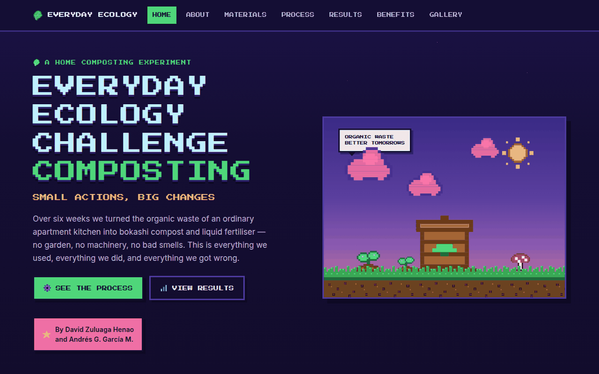
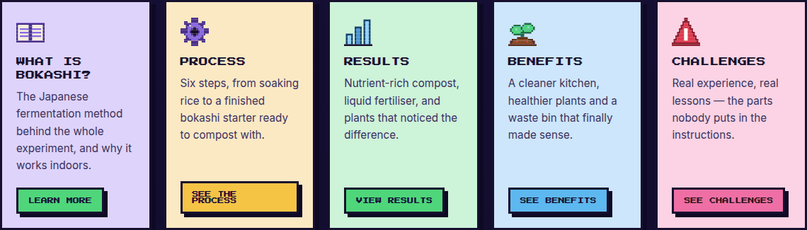
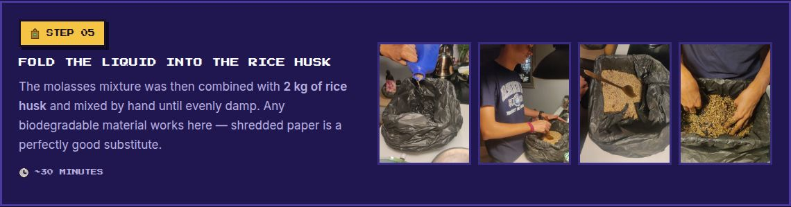
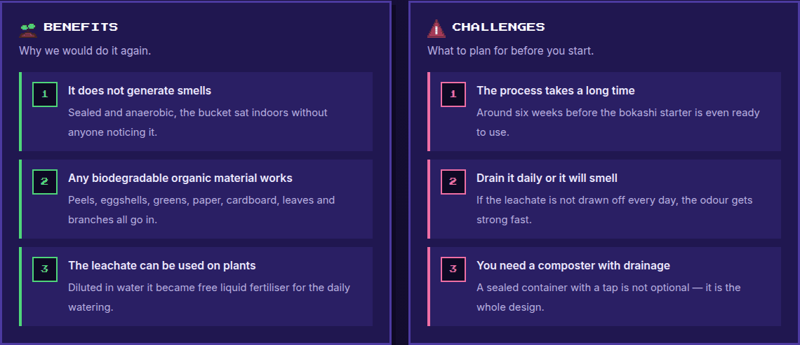
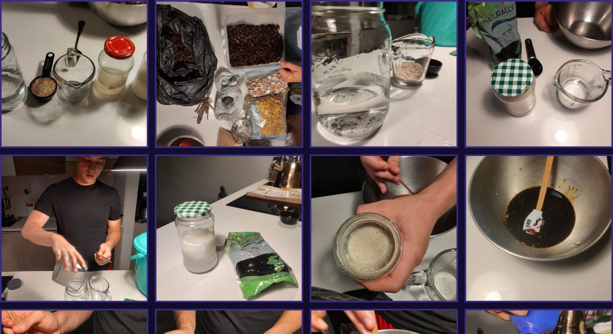
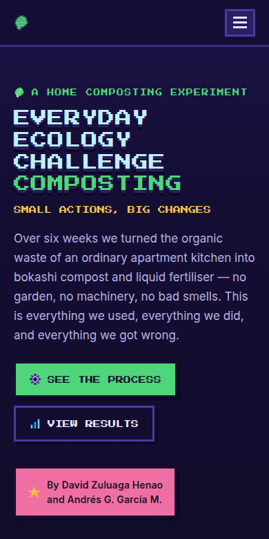
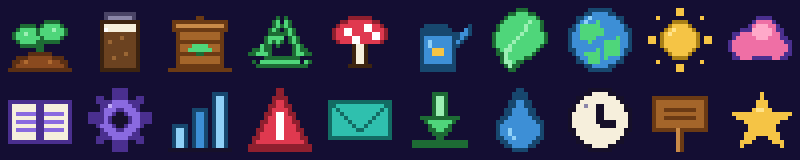

# Everyday Ecology Challenge — Bokashi Composting

A seven-page site documenting a home composting experiment: turning the organic waste of an
ordinary apartment kitchen into bokashi compost and liquid fertiliser.

By **David Zuluaga Henao** and **Andrés G. García M.**



---

## The site

Seven pages, one per section of the project.

| Page | What's on it |
| --- | --- |
| [`index.html`](index.html) | Hero, section overview, closing |
| [`about.html`](about.html) | What bokashi is and why it works indoors |
| [`materials.html`](materials.html) | Everything used, and what each ingredient does |
| [`process.html`](process.html) | The six steps, plus the daily composting routine |
| [`results.html`](results.html) | Compost, liquid fertiliser, and the numbers |
| [`benefits.html`](benefits.html) | Benefits and challenges, side by side |
| [`gallery.html`](gallery.html) | All 33 project photos with a lightbox |



### The process, step by step

Each of the six steps carries its own photography from the experiment.



### An honest verdict



### Gallery

Every stage of the experiment, in order, with a keyboard-operable lightbox.



### On a phone



---

## Pixel art

Every icon is drawn from scratch as a pixel grid and exported to SVG — no third-party asset
packs. The ground and soil textures are generated as tileable PNGs.



---

## What's in here

```
index.html … gallery.html   the seven generated pages (commit them — Vercel serves these)
styles.css                  design system + layout
script.js                   nav drawer, scroll progress, lightbox
assets/
  fonts/                    Press Start 2P + Inter, self-hosted (SIL OFL)
  icons/                    21 pixel-art SVG sprites + tileable ground/soil textures
  photos/                   full-size project photography (max 1400px, progressive JPEG)
  thumbs/                   620px thumbnails used in the grids
docs/                       screenshots used by this README
tools/
  build.py                  generates every page: shared layout + partials + sprite sheet
  partials/                 the body of each section, as its own HTML fragment
  gen_sprites.py            draws the pixel sprites and exports them as SVG
vercel.json                 static config + long-lived cache headers for /assets
```

## Editing

Content lives in `tools/partials/` — one fragment per section. Navigation, page titles and the
gallery list live in `tools/build.py`. After changing either, regenerate every page:

```bash
python3 tools/build.py
```

Editing the generated `.html` files directly works, but the next build overwrites them.

To redraw or add a sprite, edit `tools/gen_sprites.py` (sprites are pixel grids or primitive
draw calls at 16×16) and run:

```bash
python3 tools/gen_sprites.py && python3 tools/build.py
```

## Local preview

```bash
python3 -m http.server 8000
# http://localhost:8000
```

## Deploying to Vercel

No build step is required — the repository is already the deployable output.

1. Push this repository to GitHub.
2. In Vercel: **Add New… → Project → Import** this repository.
3. Framework preset: **Other**. Build command: *(leave empty)*. Output directory: `.`
4. Deploy.

## Notes

- **No external requests.** Fonts are self-hosted, icons are inline SVG, photos are local — the
  site works offline and has no third-party dependencies.
- Every photo has descriptive alt text, the lightbox is keyboard operable (arrow keys, `Esc`),
  the current page is marked with `aria-current`, and animations respect
  `prefers-reduced-motion`.
- Layout verified from 320px to 1600px.
- Press Start 2P and Inter are used under the SIL Open Font License; see
  `assets/fonts/LICENSE-*.txt`.
